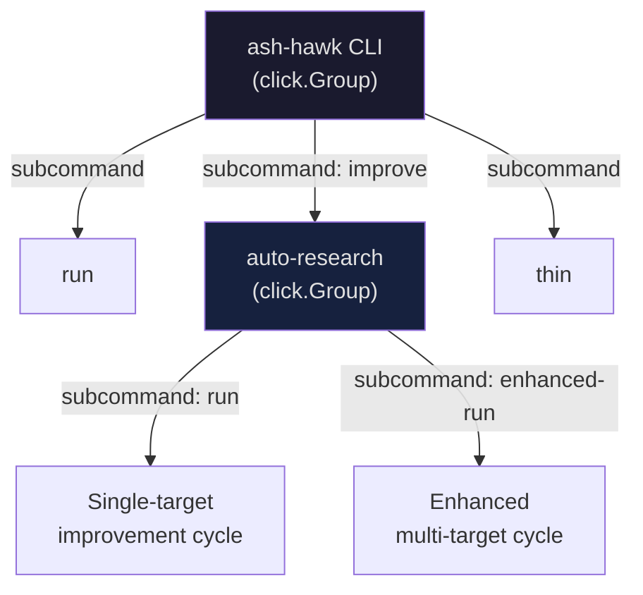
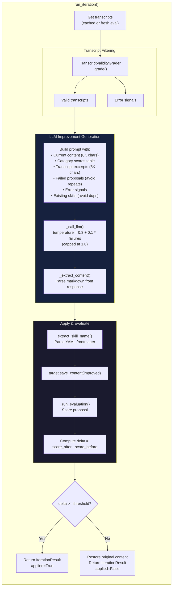
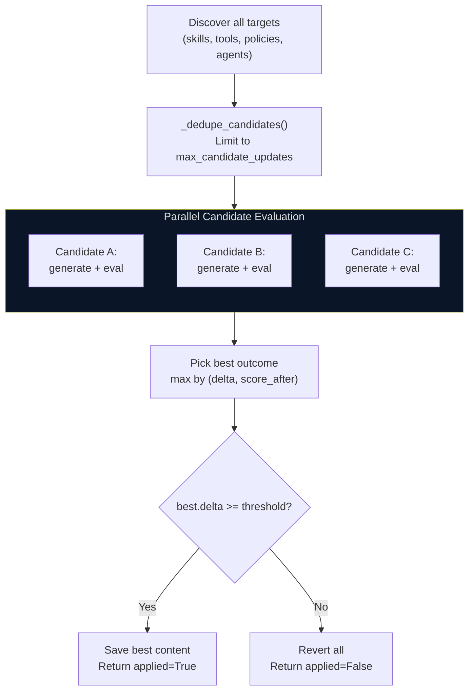
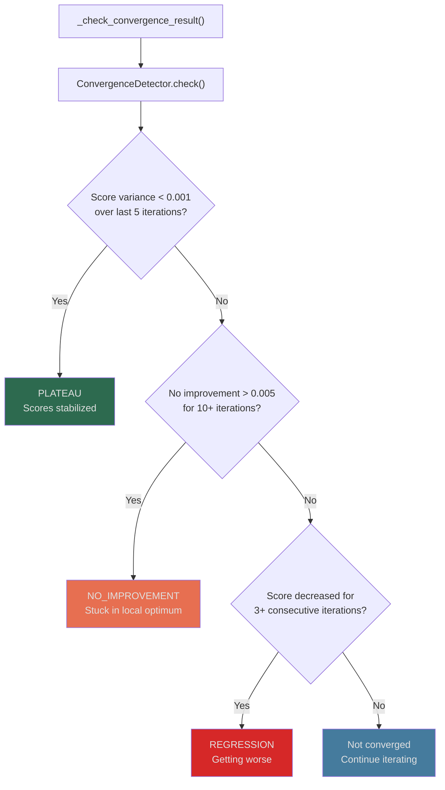
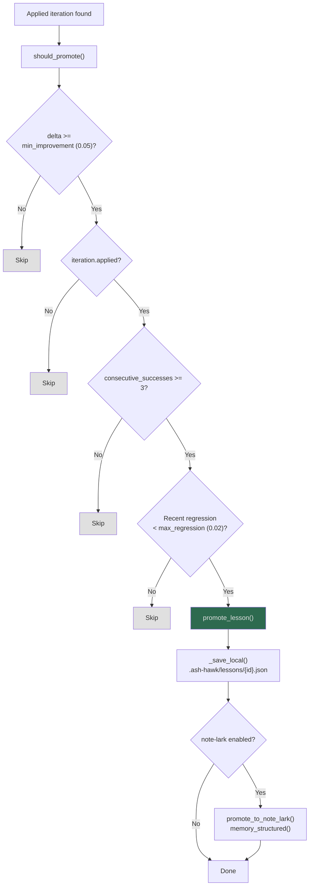
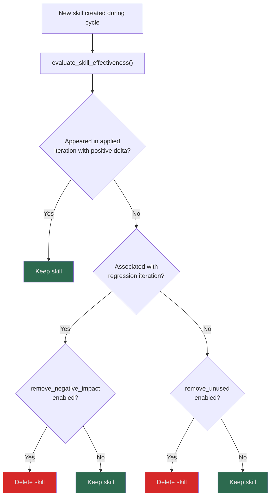
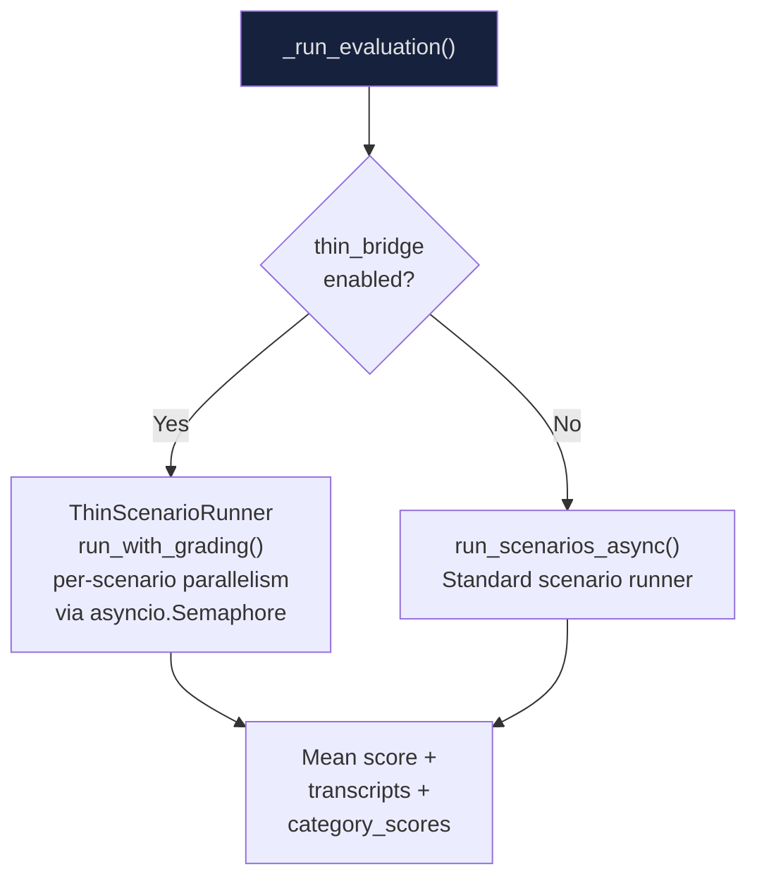
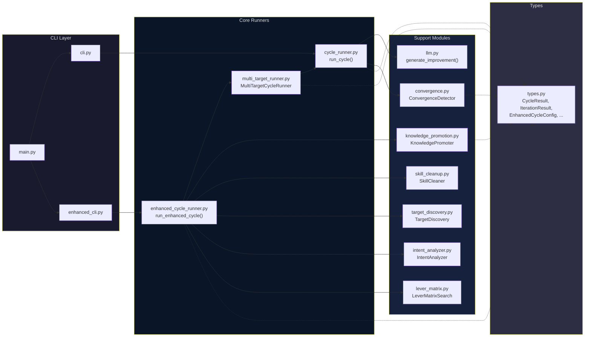

# `ash-hawk improve` Command Flow

## Overview

The `improve` command runs iterative auto-research cycles that discover agent skill/policy/tool/agent files, generate LLM-proposed improvements, evaluate them against scenario suites, and keep only changes that produce a measurable score increase.

Two modes exist:
- **`run`** — single-target improvement cycle
- **`enhanced-run`** — multi-target parallel improvement with intent analysis, knowledge promotion, lever search, and skill cleanup

---

## Top-Level Command Registration

**Entry point**: `ash_hawk/cli/main.py` registers `auto_research` as `improve`.

---

## Mode 1: `improve run` — Single-Target Cycle

```mermaid
flowchart TD
    START(["ash-hawk improve run<br/>-s scenario.yaml"]) --> PARSE["Parse CLI options<br/>(iterations, threshold,<br/>rate-limit, thin-bridge,<br/>candidate-target-updates)"]
    PARSE --> VALIDATE["_validate_auto_research_scenarios()<br/>Ensure YAML has: schema_version,<br/>id, description, sut, inputs, graders<br/>Disallow: tools, budget, expectations"]
    VALIDATE --> LLM["_create_llm_client()<br/>From dawn-kestrel settings"]
    LLM --> DISCOVER["Discover Improvement Target"]

    subgraph DISCOVER["Target Discovery"]
        direction TB
        D1["Search order:<br/>Skill → Tool → Policy → Agent"]
        D2["_find_skill_file()<br/>.dawn-kestrel/skills/*/SKILL.md"]
        D3["_find_primary_tool()<br/>.dawn-kestrel/tools/*/TOOL.md"]
        D4["_find_policy_file()<br/>.dawn-kestrel/policies/*/POLICY.md"]
        D5["_find_agent_file()<br/>.dawn-kestrel/agents/*/AGENT.md"]
        D1 --> D2 --> D3 --> D4 --> D5
    end

    DISCOVER --> INJECTOR["Create DawnKestrelInjector<br/>+ ImprovementTarget"]
    INJECTOR --> BASELINE

    subgraph BASELINE["Baseline Evaluation"]
        direction TB
        B1["run_scenarios_async()<br/>or ThinScenarioRunner"]
        B2["Collect transcripts<br/>+ category_scores"]
        B1 --> B2
    end

    BASELINE --> LOOP

    subgraph LOOP["Iteration Loop (N iterations)"]
        direction TB
        I1["Evaluate for transcripts<br/>(cache on iter 0)"]
        I2["_filter_valid_transcripts()<br/>TranscriptValidityGrader"]
        I3["LLM: generate_improvement()<br/>Focus on weakest category"]
        I4["Save proposed content<br/>to target file"]
        I5["Evaluate proposal<br/>against scenarios"]
        I6{"delta >= threshold?"}

        I1 --> I2 --> I3 --> I4 --> I5 --> I6
        I6 -->|Yes: KEEP| I7["Update current_score<br/>Reset consecutive_failures"]
        I6 -->|No: REVERT| I8["Restore original content<br/>Delete if renamed target"]

        I7 --> CONV{"Converged?"}
        I8 --> CONV
    end

    CONV -->|No: next iteration| LOOP
    CONV -->|Yes| SAVE["Save CycleResult JSON<br/>.ash-hawk/auto-research/cycles/"]
    LOOP -->|Max iterations| SAVE

    SAVE --> REPORT["Print final report:<br/>Baseline → Final score,<br/>kept/reverted counts"]

    style LOOP fill:#0a1628,color:#e0e0e0
    style BASELINE fill:#1a1a2e,color:#e0e0e0
```

---

## Single Iteration Detail

---

## Hill-Climb Mode (candidate_target_updates > 1)

When `--candidate-target-updates` > 1, the iteration evaluates multiple targets and picks the best:

---

## Mode 2: `improve enhanced-run` — Multi-Target Cycle

```mermaid
flowchart TD
    START(["ash-hawk improve enhanced-run<br/>-s scenarios/*.yaml"]) --> CONFIG["Build EnhancedCycleConfig<br/>(multi-target, intent analysis,<br/>knowledge promotion, cleanup)"]
    CONFIG --> DISCOVER["TargetDiscovery.discover_all_targets()<br/>Find all skills/tools/policies/agents"]
    DISCOVER --> HAS{"Targets found?"}
    HAS -->|No| ERR["Return error"]
    HAS -->|Yes| INTENT

    subgraph INTENT["Intent Analysis (optional)"]
        direction TB
        IA1["Run baseline evaluation<br/>run_scenarios_async()"]
        IA2["IntentAnalyzer.analyze_transcripts()<br/>Extract tool usage patterns,<br/>decision patterns, failure patterns"]
        IA1 --> IA2
    end

    INTENT --> MULTI

    subgraph MULTI["Multi-Target Parallel Improvement"]
        direction TB
        M1["MultiTargetCycleRunner<br/>asyncio.Semaphore(parallel_targets)"]
        M2["For each target:<br/>run_cycle() with explicit_targets"]
        M3["Aggregate into MultiTargetResult<br/>Weighted avg improvement"]
        M1 --> M2 --> M3
    end

    MULTI --> LEVER

    subgraph LEVER["Lever Matrix Search (optional)"]
        direction TB
        L1["LeverMatrixSearch<br/>Explore agent/skills/tools/<br/>context_strategy/prompt_preset space"]
        L2["Find best configuration"]
        L1 --> L2
    end

    LEVER --> PROMO

    subgraph PROMO["Knowledge Promotion"]
        direction TB
        P1["For each applied iteration<br/>across all targets:"]
        P2["KnowledgePromoter.should_promote()<br/>Check: min_improvement,<br/>consecutive_successes,<br/>stability"]
        P3["promote_lesson()<br/>Save to .ash-hawk/lessons/<br/>+ note-lark MCP"]
        P1 --> P2 --> P3
    end

    PROMO --> CLEANUP

    subgraph CLEANUP["Skill Cleanup"]
        direction TB
        CL1["SkillCleaner.get_baseline_skills()"]
        CL2["For each new skill created<br/>during cycle:"]
        CL3["evaluate_skill_effectiveness()<br/>Did it help or hurt?"]
        CL4["Delete low-value skills"]
        CL1 --> CL2 --> CL3 --> CL4
    end

    CLEANUP --> RESULT["EnhancedCycleResult<br/>+ Print tables + Save JSON"]

    style MULTI fill:#0a1628,color:#e0e0e0
    style PROMO fill:#16213e,color:#e0e0e0
    style CLEANUP fill:#1a1a2e,color:#e0e0e0
```

---

## Convergence Detection

---

## Knowledge Promotion Flow

---

## Skill Cleanup Decision

---

## Evaluation Paths

---

## Module Map

---

## Key File Paths

| Artifact | Location |
|---|---|
| Cycle results | `.ash-hawk/auto-research/cycles/cycle_{agent}_{timestamp}.json` |
| Iteration artifacts | `.ash-hawk/auto-research/iterations/iter_XXX_{kept\|reverted}.md` |
| Enhanced results | `.ash-hawk/enhanced-auto-research/` |
| Promoted lessons | `.ash-hawk/lessons/{lesson_id}.json` |
| Skill content | `.dawn-kestrel/skills/{name}/SKILL.md` |
| Tool content | `.dawn-kestrel/tools/{name}/TOOL.md` |
| Policy content | `.dawn-kestrel/policies/{name}/POLICY.md` |
| Agent content | `.dawn-kestrel/agents/{name}/AGENT.md` |
